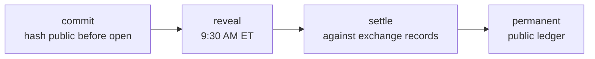

# QuantRank500

[](https://github.com/quantrank500/quantrank500/actions/workflows/tests.yml)

**A public record of stock predictions, settled by the market itself.**

Live at [quantrank500.com](https://quantrank500.com) ·
sandbox at [demo.quantrank500.com](https://demo.quantrank500.com) ·
public traffic at [analytics.quantrank500.com](https://analytics.quantrank500.com/share/WGYEGt2SJxKZeaKf)

Predictions are locked with a cryptographic commitment before the market
opens, revealed at 9:30 AM ET, and settled automatically against exchange
trade records. No self-reported results. Everyone competes with the same
simulated $500 account.

> Trust lives on the write path. Engagement lives on the read path.

The write path is INSERT-only and hash-chained — every event links to the
one before it, so anyone can verify the ledger end-to-end. Everything you
see (balances, rankings, statistics) is recomputed from that ledger on
every read: never stored, never editable.

## How it works



1. Lock a prediction (ticker, entry, stop, target) by 8:00 PM ET the prior
   trading day. Only its hash is public until the open.
2. At 9:30 AM ET the plan is revealed; it becomes a limit order for the
   session. The market fills it, or it expires unfilled — both recorded.
3. Every session is settled from minute bars: stop, target, or three-day
   expiry. Settlements are INSERT-only.
4. After 33 settled predictions a record is ranked — by the bootstrap
   lower bound of profit factor, so lucky streaks read as unproven.
   Survivorship is public.

## Layout

| Path | What lives there |
|---|---|
| `src/quantrank500/engine/` | Fill, settle, and account math — pure functions, TDD'd |
| `src/quantrank500/db/` | Hash-chained event log, schema, chain verification |
| `src/quantrank500/api/` | FastAPI app (the whole public API) |
| `src/quantrank500/market_data/` | Market-data sources, Databento ingest, universe floors |
| `src/quantrank500/worker/` | The nightly settlement replay (deterministic, idempotent) |
| `frontend/` | Vanilla JS + CSS, no build step |
| `deploy/` | Docker compose stacks (dev, demo VM, prod VM) |
| `tests/` | The suite (adversarial cases included) |

## Run it

Requires Docker.

```bash
docker compose up -d          # Postgres + API + worker + nginx
# frontend at http://localhost:8080, API at http://localhost:8000
```

Tests (Python 3.11, local Postgres):

```bash
pip install -e ".[dev]"
pytest
```

## Going deeper

[docs/DEVELOPER_FAQ.md](docs/DEVELOPER_FAQ.md) — the database design
behind the promise: hash chain, commit-reveal, tamper-evidence, what the
system can and cannot prove.

## Licensing

Code [MIT](LICENSE) · published ledger data CC0 (public domain).

*A record of predictions, not investment advice.*
