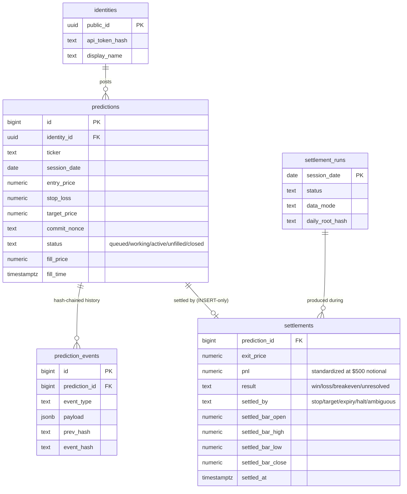

# Developer FAQ

Technical answers about how the platform keeps its core promise: a public
record that cannot be quietly rewritten. Every answer points at the code —
don't take our word for anything.

For the user-level version (fills, floors, what statistics mean), see the
site's [FAQ](https://quantrank500.com/faq.html) and
[Definitions](https://quantrank500.com/glossary.html).

---

## Is the ledger actually immutable? You run the database.

Honest answer: it is **tamper-evident, not tamper-proof**. Whoever operates
the database could rewrite rows — no application can prevent that. What the
design guarantees is that any rewrite is *detectable*:

- Every event is hash-chained to the one before it
  (`src/quantrank500/db/events.py`). Changing any past event breaks the
  chain for everything after it.
- Every settlement run records a `daily_root_hash`
  (`settlement_runs` table), and the full ledger is exported nightly under
  CC0 — so copies live in other people's hands. A rewrite would have to
  explain why today's chain disagrees with yesterday's public export.

Trust here means: *you don't have to trust us; you can catch us.*

## How does the hash chain work?

Each row in `prediction_events` stores `prev_hash` and
`event_hash = SHA-256(prev_hash ‖ canonical_payload)`. The chain is
**global** — one sequence across all predictions, starting from a genesis
constant of 64 zeros — so no single prediction's history can be excised
without breaking every event after it. Verification is ~30 lines:
`src/quantrank500/db/chain.py` — connect, iterate, recompute, compare.

## How does commit–reveal prevent backdating a call?

1. At submission, only the prediction's SHA-256 commitment is public —
   computed over a canonical payload plus a 128-bit random nonce
   (`src/quantrank500/commitment.py`). The content stays sealed.
2. Timestamps come from the **database clock**, never the client's.
3. At 9:30 AM ET the payload and nonce are revealed. Anyone can recompute
   the hash from the revealed fields and compare it with the commitment
   that was public before the open.

A war story worth knowing if you touch this code: Postgres JSONB
*normalizes* stored JSON (key order, number formatting), which silently
broke hash verification until payloads were canonicalized — sorted keys,
compact separators, prices at exactly four decimals — on **both** the
write path and the verify path. If you change any payload field, the
canonical form is the contract.

## Why is nothing stored for balances and rankings?

The design invariant: **trust lives on the write path; engagement lives on
the read path.** The write path (`predictions`, `prediction_events`,
`settlements`) is INSERT-only. Everything you see — account balances,
scoreboard rankings, statistics — is *recomputed from the ledger on every
read* (`src/quantrank500/engine/account.py`, `src/quantrank500/stats.py`).
A stored balance would be a second source of truth, which is to say: a
place where a lie could live.

## Schema tour

Design notes worth noticing:

- **`settlements` embeds the settling bar's OHLC.** Every verdict carries
  its own evidence — you can check a settlement against the very bar that
  produced it without refetching market data.
- **`pnl` is standardized at $500 notional** (the audit constant), so any
  auditor can recompute account balances by replaying settlements with the
  ⅓-of-balance sizing rule. Account impact is derived, never stored.
- **A separate `lake` schema** (`lake.minute_bars`, `lake.daily_prices`)
  holds market data with first-write-wins upserts — the lake is evidence
  too, never rewritten (`src/quantrank500/market_data/databento.py`).

## Why not a blockchain?

This is a single-writer system: one operator ingests market data and runs
settlement. Consensus solves a problem we don't have (many mutually
distrusting writers) at a cost we'd rather not pay. A hash chain plus
public CC0 exports gives the property that matters — anyone can detect
tampering — and the *market itself* is the oracle: settlements are checked
against exchange trade records anyone can buy.

## How do I independently verify a settlement?

1. Pull the ledger export (or the per-identity CSV — column reference on
   the site's Definitions page).
2. Recompute the commitment from the revealed fields + nonce; compare with
   the pre-open commitment.
3. Fetch minute bars for the ticker/session from any provider and apply
   the engine rules — the fill and settle functions are pure and ~200
   lines total (`src/quantrank500/engine/fill.py`, `engine/settle.py`).
4. Expect cent-level differences across data providers (venue blends
   differ); the settling bar embedded in the settlement row shows exactly
   what the platform saw.

## How do fills work at the open?

Predictions are limit orders, and the engine honors real limit-order
semantics (`src/quantrank500/engine/fill.py`): a touch of your entry price
fills you, and if the session *opens* below your entry, you fill at the
open — you never pay more than the market asks (gap improvement).

That cuts both ways. The ledger's own prediction #1 is the canonical
example: a limit at 11.13 on a stock that opened at 10.50 filled at
10.50 — *below the plan's stop of 10.52*. Born underwater. The engine
doesn't pretend a stop above your fill protects you: the position settled
against the predictor at a real market price the same session. Ambiguity
always resolves against the predictor — the record errs toward
understatement, never flattery.

## What happens on halts or missing data?

Settlement never fabricates. If an outcome can't be determined, the result
is `unresolved` — excluded from every statistic and visibly labeled.
Settlement runs are deterministic and idempotent: `run_settlement` can
replay any past session with identical results, and `catch_up` self-heals
missed nights (`src/quantrank500/worker/nightly.py`). Determinism is a
feature: the whole history is re-derivable.

Cadence: the worker runs twice each weekday, but the run after midnight ET
is the one that does the real work — a session's exchange records publish
overnight, so outcomes land on the ledger before the next open. A
prediction showing `queued` throughout its own session day is the normal
state, not a stall.

## What can't the system prove?

That a prediction was *tradeable*. Fills use a touch rule on a venue-blend
feed: real orders can fail to fill at a touched price, and thin stocks can
print differently across venues. Both effects are small inside the
platform's eligibility floors and both lean conservative (see the site
FAQ), but the honest framing stands: this is a record of prediction
accuracy, not of executable returns.

---

Questions this page doesn't answer: open an issue — good questions become
new entries.
